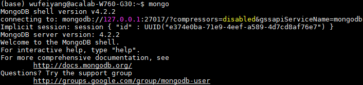
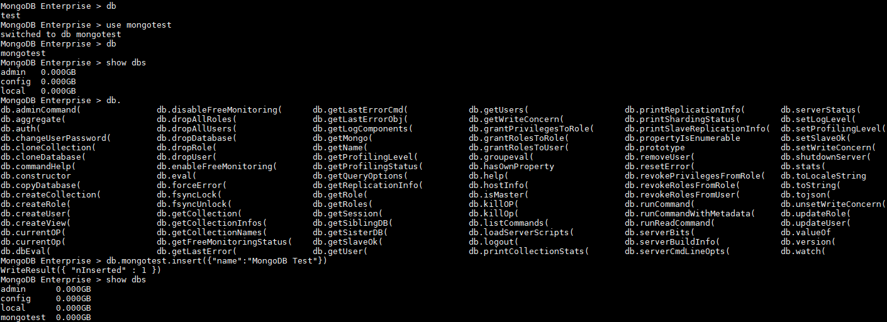
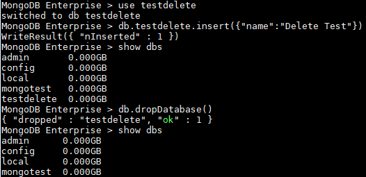

# MongoDB
## MongoDB概念
MongoDB是一个基于分布式文件存储的数据库。由C++语言编写。旨在为WEB应用提供可扩展的高性能数据存储解决方案。

MongoDB是一个介于关系数据库和非关系数据库之间的产品，是非关系数据库当中功能最丰富，最像关系数据库的。它支持的数据结构非常松散，是类似json的bson格式，因此可以存储比较复杂的数据类型。Mongo最大的特点是它支持的查询语言非常强大，其语法有点类似于面向对象的查询语言，几乎可以实现类似关系数据库单表查询的绝大部分功能，而且还支持对数据建立索引。

MongoDB中与传统SQL数据库术语和概念对比如下表所示：
SQL术语|MongoDB术语|说明
-|-|-
database|database|数据库
table|collection|数据库表/集合
row|document|数据记录行/文档
column|field|数据字段/域
index|index|索引
table joins||表连接,MongoDB不支持
primary key|primary key|主键，MongoDB自动将_id字段设置为主键

## MongoDB安装配置
- 操作系统环境：Ubuntu 16.04.6 LTS (GNU/Linux 4.15.0-70-generic x86_64)
1. 下载数据库压缩包
```
$ wget https://downloads.mongodb.com/linux/mongodb-linux-x86_64-enterprise-ubuntu1604-4.2.2.tgz
```
2. 解压缩数据库压缩包
```
$ tar -zxvf mongodb-linux-x86_64-enterprise-ubuntu1604-4.2.2.tgz
```
3. 配置环境变量
```
$ vim ~/.bashrc
export PATH=/home/wufeiyang/Env/mongodb/mongodb-linux-x86_64-enterprise-ubuntu1604-4.2.2/bin:$PATH
$ source ~/.bashrc
```

4. 创建数据库目录并指定数据库目录来启动MongoDB服务
```
$ mkdir -p ~/File/mongodb/data/db
$ mongod --dbpath ~/File/mongodb/data/db
```
运行结果如下图所示：

<div align="center">
  
</div>

5. 验证运行MongoDB后台管理Shell

完成第4步启动服务后，运行`$ mongo`开启MongoDB后台管理Shell，运行结果如下图所示：

<div align="center">
  
</div>

## MongoDB操作实例
- 操作系统环境：Ubuntu 16.04.6 LTS (GNU/Linux 4.15.0-70-generic x86_64)
- MongoDB shell version： v4.2.2
### 数据库
1. 查看所有的数据库
```
> show dbs
admin   0.000GB
config  0.000GB
local   0.000GB
```
2. 查看当前数据库
```
> db
test
```
3. 创建数据库（并会自动切换为当前数据库）
```
> use mongotest
switched to db mongotest
> db
mongotest
```
4. 新建数据库不会显示在`> show dbs`结果中，因此要插入一些数据来让他显示在列表中
```
> db.mongotest.insert({"name":"MongoDB Test"})
WriteResult({ "nInserted" : 1 })
> show dbs
admin      0.000GB
config     0.000GB
local      0.000GB
mongotest  0.000GB
```

<div align="center">
  
</div>

5. 删除数据库

删除数据库通过切换到需要删除的数据库后调用`db.dropDatabase()`方法来删除
```
> db.dropDatabase()
{ "dropped" : "testdelete", "ok" : 1 }
```
测试时，我先建立新的空数据库并插入数据让其显示在数据库列表中，后删除数据库并确认其不在数据库列表中了，测试过程如下图所示：

<div align="center">
  
</div>

### 集合
1. 创建集合使用`db.createCollection()`方法
```
> db.createCollection("testcol")
{ "ok" : 1 }
```

2. 查看当前数据库所有集合集合使用`> show collections`
```
> show collections
mongotest
testcol
```

3. 删除集合使用`db.<COL_NAME>.drop()`方法，例如：
```
MongoDB Enterprise > db.mongotest.drop()
true
```

测试过程如下图所示：

<div align="center">
  
</div>

### 