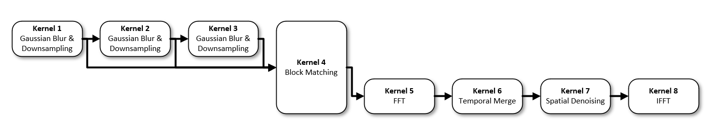
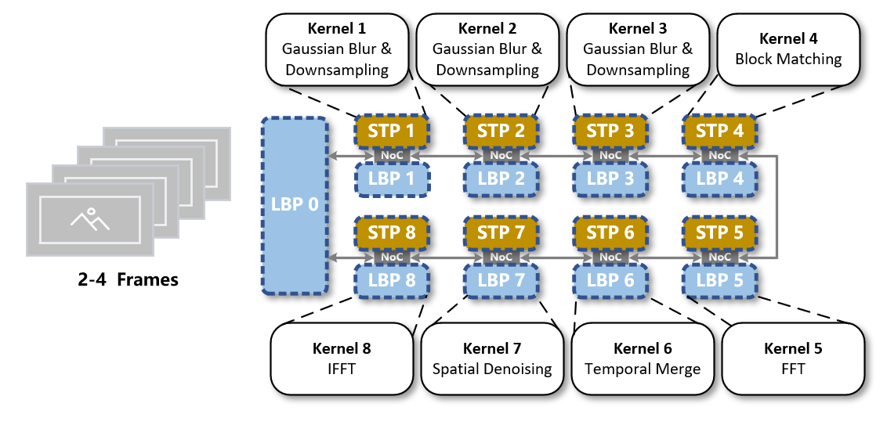
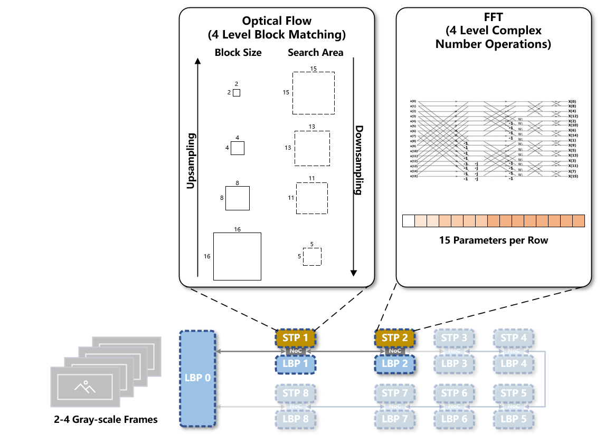
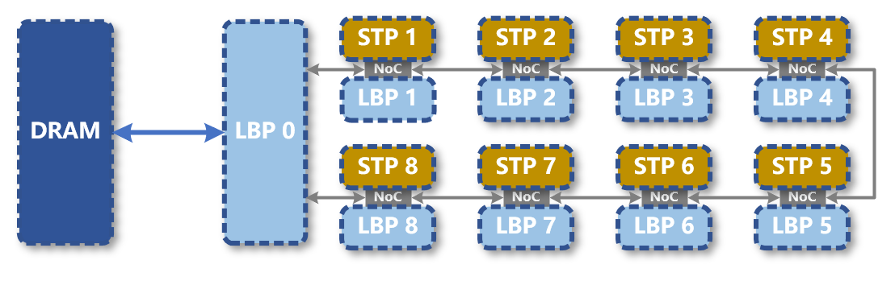
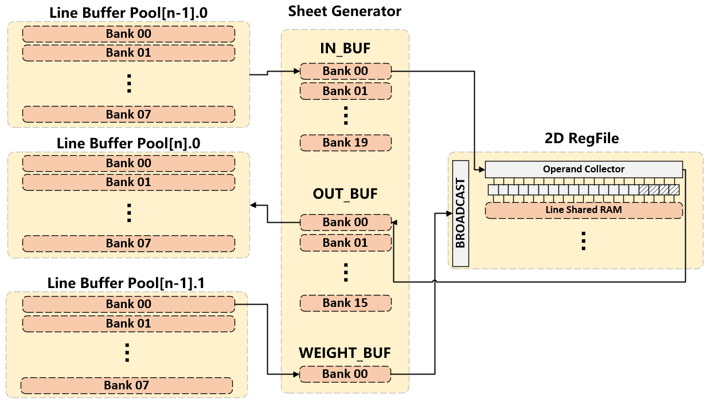
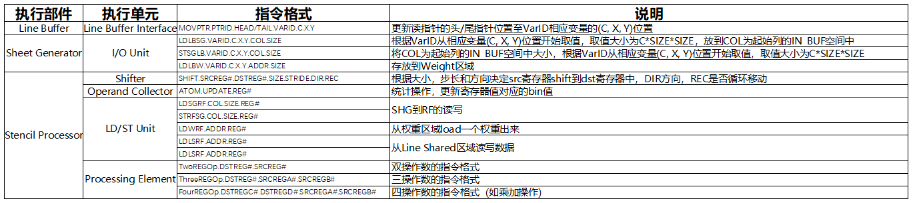

# IPU-Sim# IPU详细设计
## HDR+算法设计
HDR+算法的核心部分（不包括用于控制镜头采集图像的前处理操作和用于输出实际展示效果的后处理操作）我们认为由4层高斯金字塔下的光流法对齐，快速傅里叶变换(FFT)，时域合成，空域去噪，快速傅里叶逆变换(IFFT)构成。

> **存在的问题**：HDR+将图片“认为”是单通道的，实际上是以Bayer格式存储下限制最小操作像素级别（间隔2个像素计算）来实现的，对于[R,G,B]格式存储的图片格式，需要找到对应解决方案。

期望应用场景为4K图像能达到60帧/秒的输出速度，图像数据的输入输出数据流分析如下：
```
Image_4th[4][2160][4096] ---> Gaussian Blur & Downsampling 4x ---> Image_3rd[4][1080][2048]
Image_3rd[4][1080][2048] ---> Gaussian Blur & Downsampling 4x ---> Image_2nd[4][540][1024]
Image_2nd[4][540][1024] ---> Gaussian Blur & Downsampling 4x ---> Image_1st[4][270][512]

// Image 0 and Image 1 alignment
Image_1st[0][270][512], Image_1st[1][270][512] ---> 2x2 Block Matching in Search Area[15,15]   ---> Offset[][]
Image_2nd[0][540][1024], Image_2nd[1][540][1024] ---> 4x4 Block Matching in Search Area[13,13]   ---> Offset[][]
Image_3rd[0][1080][2048], Image_3rd[1][1080][2048] ---> 8x8 Block Matching in Search Area[11,11]   ---> Offset[][]
Image_4th[4][2160][4096], Image_4th[1][2160][4096] ---> 16x16 Block Matching in Search Area[5, 5]   ---> 256*135*[16, 16] sheets of Image_4th[1]

// Image 0 and Image 2 alignment
Image_1st[0][270][512], Image_1st[2][270][512] ---> 2x2 Block Matching in Search Area[15,15]   ---> Offset[][]
Image_2nd[0][540][1024], Image_2nd[2][540][1024] ---> 4x4 Block Matching in Search Area[13,13]   ---> Offset[][]
Image_3rd[0][1080][2048], Image_3rd[2][1080][2048] ---> 8x8 Block Matching in Search Area[11,11]   ---> Offset[][]
Image_4th[4][2160][4096], Image_4th[2][2160][4096] ---> 16x16 Block Matching in Search Area[5, 5]   ---> 256*135*[16, 16] sheets of Image_4th[2]    

// Image 0 and Image 3 alignment
Image_1st[0][270][512], Image_1st[3][270][512] ---> 2x2 Block Matching in Search Area[15,15]   ---> Offset[][]
Image_2nd[0][540][1024], Image_2nd[3][540][1024] ---> 4x4 Block Matching in Search Area[13,13]   ---> Offset[][]
Image_3rd[0][1080][2048], Image_3rd[3][1080][2048] ---> 8x8 Block Matching in Search Area[11,11]   ---> Offset[][]
Image_4th[4][2160][4096], Image_4th[3][2160][4096] ---> 16x16 Block Matching in Search Area[5, 5]   ---> 256*135*[16, 16] sheets of Image_4th[3]

4*256*135*[16, 16] sheets ---> DFT ---> 8*256*135*[16, 16] sheets
8*256*135*[16, 16] sheets ---> Temporal Merge ---> 2*256*135*[16, 16] sheets
2*256*135*[16, 16] sheets ---> Spatial Denoising ---> 2*256*135*[16, 16] sheets
2*256*135*[16, 16] sheets ---> IFFT ---> Output Image[2160][4096]
```
分析谷歌专利后，发现Sheet Generator(SHG)实现的“Upsamling”和“Downsampling”并不是真正意义上的升降采样，仅仅是切分sheet的一种方式，因此要进行高斯金字塔降采样必须要在STP内进行，出于对变量控制的考虑，为了保证金字塔的每层变量能够存储在不同LBP中以方便变量存储，对于3次高斯核卷积+降采样应该分布在3个STP内完成。
> **存在的问题**：该设计可能会导致负载均衡问题，显而易见地，在块匹配(Block Matching)和FFT/IFFT阶段计算量明显高于高斯核卷积+降采样计算量，后续可能会进行调整。

Kernel之间的数据依赖可以用有向无环图来表示：


因此目前设计的Kernel和STP的对应关系如下图所示。


~~以前认为的一种可行的Kernel映射到STP上的方案如下图所示，主要问题在于SHG并不能完成升降采样的相应工作而且会导致多余的存储情况。~~


## IPU结构设计
IPU总体结构如下图所示，Line Buffer Pool(LBP)是数据的中转站，Stencil Processor(STP)是实际的运算单元，两者之间通过NoC连接起来，在简单实现中也可以通过crossbar方式连接。

数据从DRAM中读取到LBP 0后，不同的核函数(Kernel)会依次分布到STP1-8上进行运算，运算的输入数据由生产者-消费者模型确定，运算的输出数据存放在LBP1-8中，并由算法流程的最后一个Kernel负责将数据输出。我们认为Line Buffer Pool需要承担GPU中显存的任务，所以DRAM与Line Buffer Pool以及卷积算子所需的存放在DRAM中的权重数据的搬移是由CPU指令负责(即启Kernel时传入)。
### 存储层次结构
存储层次结构设计如下图所示：

存储层次主要分为3部分：
- Line Buffer Pool
  - 每个LBP由1至多个Line Buffer Interface管理其中变量的格式
  - 分8个大Bank，每个Bank有一定大小(Google为16KB)的存储空间
- Sheet Generator
  - IN_BUF：分20个小Bank，直接对应STP内2D Register File
  - OUT_BUF：分16个小Bank，因为输出范围一定在16*16大小以内
  - WEIGHT_BUF：用于广播权重的特殊区域
- 2D Register File
  - Shiftable Register File：可shift的寄存器堆，共20\*20\*4个
  - Register File：PE内寄存器，目前暂时认为16个
  - Line Shared RAM：与2D RF相连，目前认为是SRAM的模式（是否有可能做成crossbar的寄存器堆？）
> **存在的问题**：关于权重数据是否能通过总I/O单元直接写入到Line Shared RAM中仍需要讨论，WEIGHT_BUF主要用于块匹配中将参考帧图像数据“转换”为权重的情况，我认为也可以将WEIGHT_BUF暴露给CPU。

### 控制逻辑
指令根据执行单元的不同，有多个执行单元参与指令的实际执行，具体见[指令设计文档](https://shimo.im/sheets/DDWdd9GRtVQjjkpJ/ec8Zj)。

对于以下部件，需要有：
- Line Buffer Interface
  - LBP虚拟地址转换
  - LBP内读写指针的管理和数据的更新(pop操作)
  - 接受更新读指针位置的命令并执行
- SHG I/O Unit
  - 有带取模运算的32位运算单元用于地址计算
  - 管理COL指向区域，对于完成读写的数据pop出去
- Operand Collector
  - 合并PE的读写请求，需求32位运算单元进行地址计算
  - 原子操作，用于直方图等统计操作的更新
- Shifter
  - 接受shift操作指令并实际控制2D RF进行shift操作
- LD/ST Unit
  - 每个PE都有的load store单元，用于接受load store指令
