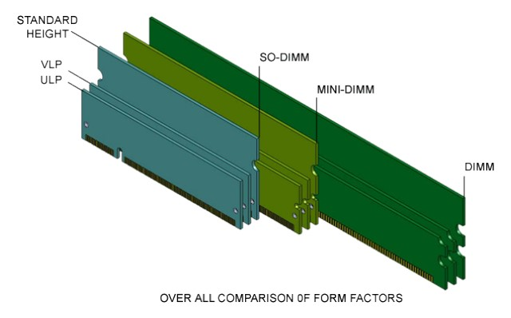
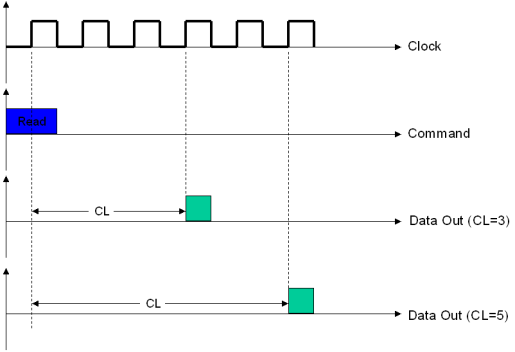
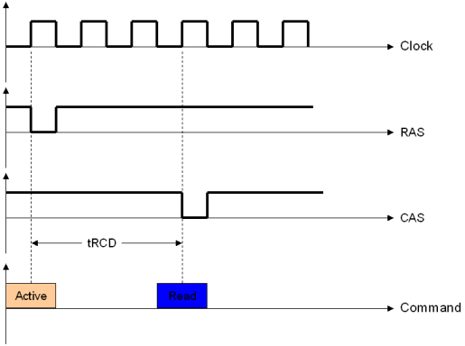
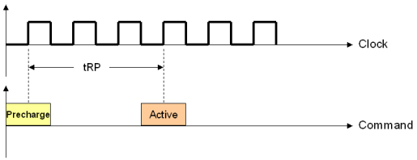

# 内存条
本文摘自知乎文章[内存系列一：快速读懂内存条标签](https://zhuanlan.zhihu.com/p/26255460)和[内存系列二：深入理解硬件原理](https://zhuanlan.zhihu.com/p/26327347)，并根据知乎文章可能参考的原文[Todo memorias [Informacion sobre Memorias RAM]](https://www.taringa.net/+info/todo-memorias-informacion-sobre-memorias-ram_107o8m)进行了整合。主要介绍了内存条的基本信息及标签上部分数值的含义。
## 内存条基本形态
由80286时代的DIP（Dual In-line Package），80386时代的SIMM（Single-Inline Memory Module），到64位奔腾处理器后使用DIMM（Double-Inline Memory Module）。
- RDIMM：**服务器用**，市场主流有ECC。
> ECC：修正错误存储器（Error-Correcting Code memory）指能够实现错误检查和纠正错误技术的内存。ECC内存之所以广泛应用于服务器领域，并非其性能，而是因为ECC内存的纠错能力，使服务器保持稳定。
- UDIMM：**标准台式用**，市场主流无ECC。
- SO-DIMM：**笔记本用**，分为有/无ECC。
- Mini-DIMM：**高端领域用**，它是Registered DIMM的缩小版本，用于刀片式服务器等对体积要求苛刻的高端领域。

高度也从矮到高分为ULP，VLP和标准高度，如下图所示。

## DDR命名规则
> SDRAM：同步动态随机存取內存（synchronous dynamic random-access memory）是有一个同步接口的动态随机存取內存（DRAM）。

> DDR：双倍数据流SDRAM（Double Data Rate SDRAM）
- 大部分**台式机用**UDIMM命名规则：PCx-y，x代表DDR代数，y代表数据传输率（是时钟周期的两倍）
- 大部分**笔记本用**SO-DIMM和**服务器用**RDIMM命名规则：DDRx-z，x代表DDR代数，z代表最大带宽

其中z = y * 8，具体例子（常见DDR3和DDR4标注）如下表。

内存|时钟|带宽|标注
:-|:-|:-|:-
DDR3-800|400MHz|6,400MB/s|PC3-6400
DDR3-1066|533MHz|8,500MB/s|PC3-8500
DDR3-1333|666MHz|10,600MB/s|PC3-10600
DDR3-1600|800MHz|12,800MB/s|PC3-12800
DDR4-1600|800MHz|12,800MB/s|PC4-12800
DDR4-1866|933MHz|14,900MB/s|PC4-14900
DDR4-2133|1066MHz|17,000MB/s|PC4-17000
DDR4-2400|1200MHz|19,200MB/s|PC4-19200
DDR4-2666|1333MHz|21,300MB/s|PC4-21300
DDR4-3200|1600MHz|25,600MB/s|PC4-25600

## 寻址（Addressing）
一个i7 CPU支持双Channel（通道），每个Channel能插两个DIMM内存条，每个DIMM由内存条正反两面构成两个Rank，每个Rank由8个Chip构成，每个Chip又分成8个Bank，如下图所示。

每个Bank上的存储颗粒中的一个格子的选择信号有：
1. 片选（Chip Select）信号，S0#和S1#，每个用于选择是哪个Rank。
2. Bank地址线，BA0-BA2, 2^3=8,可以选择8个Bank
3. 列选 (Column Address Select), CAS#,用于指示现在要选通列地址。
4. 行选（Row Address Select），RAS#用于指示现在要选通行地址。
5. 地址线，A0-A13，用于行和列的地址选择（可并不都用于地址，本处忽略）。
6. 数据线，DQ0-DQ63，用于提供全64bit的数据。
7. 命令，COMMAND,用于传输命令，如读或者写等等。

> 注意这里没有内存颗粒的选择信号线，只有Rank的选择信号。在Rank选择好后，8个内存颗粒一起被选中，共提供64bit的数据。

读写数据简述为三步：
1. 行有效。RAS#低电平，CAS#高电平，行地址有效，A0-A13传送行地址信号，即2^13个Row可以选择;
2. 列有效。RAS#高电平，CAS#低电平，列地址有效，A0-A13传送列地址信号（即A0-A13是行列共用的），1和2两步唯一确定一个格子;
3. 数据读出或写入。根据COMMAND进行读取或者写入。在选定好小方格后，就已经确定了具体的存储单元，剩下的事情就是数据通过数据I/O通道（DQ）输出到内存总线上了。

## 时延（Latency）
1. CL：CAS延迟（CAS Latency，简称CL），指列选信号发出后，到数据被读取输出间的时间延迟，因为读取时才会发生故也称为读取时延（Read Latency，简称RL）。CL是时延中最重要的参数，有的内存标签会标上`CLx`，即CAS与数据被读取输出间有x个时钟周期的时延，因此越小越好。

2. tRCD：RAS到CAS延迟（RAS to CAS Delay）。在发送列选信号时必须要与行选信号有一个间隔，这是根据芯片存储阵列电子元件响应时间所制定的延迟。

3. tRP：RAS预充电（Row Precharge）。从内存中检索数据后，需要发出一个名为Precharge的命令，关闭刚刚使用过的行并允许新的行可用。RAS预充电（tRP）是在发出预充电命令和下一个激活（“激活”命令）行的命令之间发生的时间。Active命令启动读取或写入循环。

4. tRAS：有效预充电延迟（RAS Active Time）。内存应该等待多长时间才能开始下一次访问内存。*翻阅资料并没有完全弄清这个值的含义，有[资料](https://www.bilibili.com/read/cv256341/)表明`tRAS >= tRCD + tRP`，根据这个说法我认为tRAS即内存在读写完一次数据后，等待该时间，即等待过了RAS的预充电和RAS到CAS的时延后，进入CAS延迟时间内，即可开始下一次访存了。

更多有关内存的详细说明可以参考[AMD社区博客](https://community.amd.com/community/gaming/blog/2017/05/25/community-update-4-lets-talk-dram)

